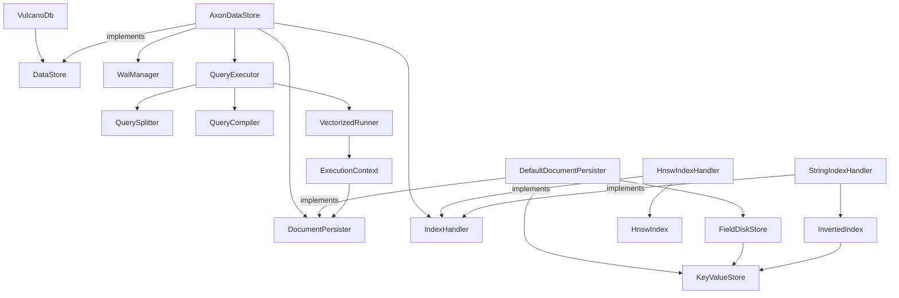
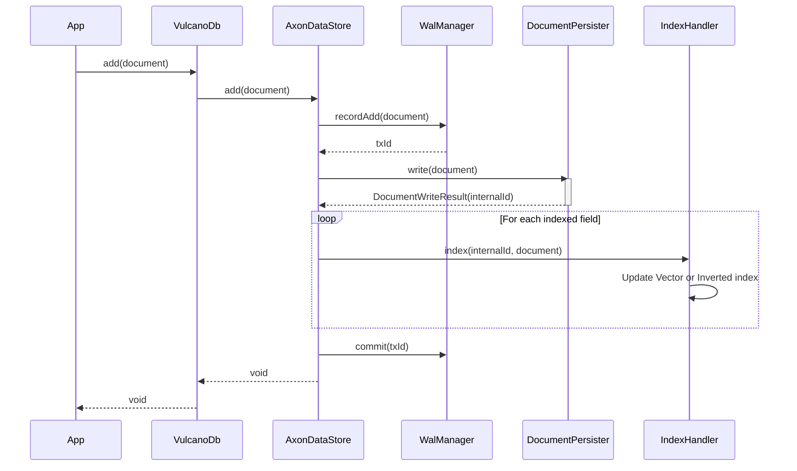

# Low-Level Design Document: VulcanoDB

## 1. Overview
VulcanoDB is a high-performance vector database that integrates traditional document storage with advanced indexing for both vectors and attributes. This document describes the internal components, their relationships, and the core workflows of the system, focusing on the `AxonDataStore` implementation.

## 2. System Architecture

### 2.1 Component Overview
The system is divided into three main layers:
1.  **API Layer (`VulcanoDb`)**: Provides the main entry point for document management and searching.
2.  **Storage Engine Layer (`DataStore`)**: Implements persistence and indexing. `AxonDataStore` is the primary implementation.
3.  **Core Components**: Internal modules for query evaluation, document representation, and indexing algorithms.

### 2.2 Dependency Diagram
The following diagram illustrates the high-level dependencies between the main components of VulcanoDB.

## 3. Storage Layer Design

### 3.1 AxonDataStore
`AxonDataStore` is the heart of the persistence layer. It coordinates document storage, write-ahead logging (WAL), and indexing.

- **WAL (`WalManager`)**: Records every `add` or `remove` operation before execution to ensure durability and recovery.
- **Document Persister (`DocumentPersister`)**: Handles the physical storage of documents.
- **Index Registry**: Keeps track of which fields are indexed. Supports both HNSW (vector) and Inverted (string) handlers.

### 3.2 Document Persistence
The `DefaultDocumentPersister` decomposes documents into individual fields:
- **Dictionary**: A `KeyValueStore` that maps external `DocumentId` to an `internalId` and stores the `DocumentShape`.
- **FieldDiskStore**: Manages a set of `KeyValueStore` instances, one per field name and type combination.

### 3.3 Thread-Safe Data Logging
The `DataLog` implements a highly concurrent binary log using atomic space reservation:
- **Atomic Reservation**: Uses `reserved.getAndAdd(maxEntrySize)` to ensure threads never overlap in memory.
- **Header Integrity**: Stores unaligned `rawSize` in headers. Readers calculate payload length by accounting for internal alignment padding.
- **Safety Margins**: Reserves extra bytes to accommodate dynamic alignment requirements in a thread-safe manner.

## 4. Query Evaluation Design

The query evaluation follows a multi-phase pipeline designed for speed and efficiency.

### 4.1 Query Pipeline
1.  **Optimization (Logical Phase)**: `QuerySplitter` analyzes the logical query tree and splits it into two parts:
    - **Index Tree**: Parts of the query that can be satisfied using indexes (vector similarity or indexed string matches).
    - **Residual Tree**: Parts of the query that require a scan over the candidate documents.
2.  **Compilation (Physical Phase)**: `QueryCompiler` transforms logical nodes into physical operators:
    - `BitmapOperator`: Executable code for index lookups returning sets of `docId`.
    - `DocumentMatcher`: Functional predicates for document attribute filtering.
3.  **Execution Phase**:
    - `BitmapOperator` produces a candidate set of `docId` using bitset math (Roaring Bitmaps).
    - `VectorizedRunner` performs a scan over the candidates, applying the `DocumentMatcher` and ranking results.

### 4.2 Sequence Diagram: Document Search
This diagram shows the flow of a search request through the system.

## 5. Indexing Design

### 5.1 HNSW Indexing
Vector fields are indexed using a Hierarchical Navigable Small World (HNSW) graph for approximate nearest neighbor search.

### 5.2 Attribute Indexing
String fields can be indexed using a persistent `InvertedIndex`.
- **Exact Match**: Optimized via direct hash lookup in the `KeyValueStore`.
- **Partial Match**: Supports `STARTS_WITH`, `ENDS_WITH`, and `CONTAINS` by iterating over unique terms stored in the index.
- **Storage**: Maps terms to comma-separated internal document IDs, managed with precise byte-level length validation to ensure data integrity.

### 5.3 Sequence Diagram: Document Insertion
This diagram illustrates how a document is persisted and indexed.

## 6. Technical Considerations
- **Concurrency**: `AxonDataStore` uses virtual threads for asynchronous operations. Storage writes are synchronized via atomic memory reservation in the `DataLog`.
- **Durability**: The WAL ensures crash consistency by replaying operations upon initialization.
- **Performance**: High-performance binary serialization and bitset-driven query evaluation minimize overhead. Attribute indexes provide O(1) lookups for filtered queries.
