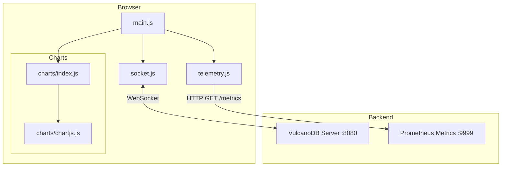

# VulcanoDB RAG Frontend

A high-performance, real-time dashboard for monitoring and interacting with VulcanoDB's Retrieval-Augmented Generation (RAG) capabilities.

## Architecture

The frontend is built with vanilla JavaScript for maximum performance and minimal overhead, using Vite as a build tool and development server.

### JS Architecture

The following diagram illustrates the component-based architecture of the frontend:



### Key Components

- **`main.js`**: Orchestrates the UI, manages chat history, and handles global events.
- **`socket.js`**: Manages the WebSocket connection to the VulcanoDB server for real-time chat and status updates.
- **`telemetry.js`**: Periodically polls Prometheus-style metrics from the backend and dispatches updates.
- **`charts/`**: Encapsulates chart logic, using Chart.js as the underlying provider for visualizations like gauges and multi-axis time-series charts.

## Running the Frontend

### Prerequisites

- [Node.js](https://nodejs.org/) (version 18 or higher recommended)
- [npm](https://www.npmjs.com/)

### Installation

1. Navigate to the frontend directory:
   ```bash
   cd examples/RAG/frontend
   ```
2. Install dependencies:
   ```bash
   npm install
   ```

### Development

To start the development server with Hot Module Replacement (HMR):
```bash
npm run dev
```
The application will be available at `http://localhost:5173` (or the port indicated in your terminal).

### Production Build

To build the project for production:
```bash
npm run build
```
The optimized assets will be generated in the `dist` directory.

### Other Commands

- `npm run lint`: Run ESLint to check for code quality issues.
- `npm run format`: Format the code using Prettier.

## Integration with VulcanoDB

The frontend expects the VulcanoDB server to be running with:
- WebSocket server on `ws://localhost:8080/ws`
- Prometheus metrics endpoint on `http://localhost:9999`
