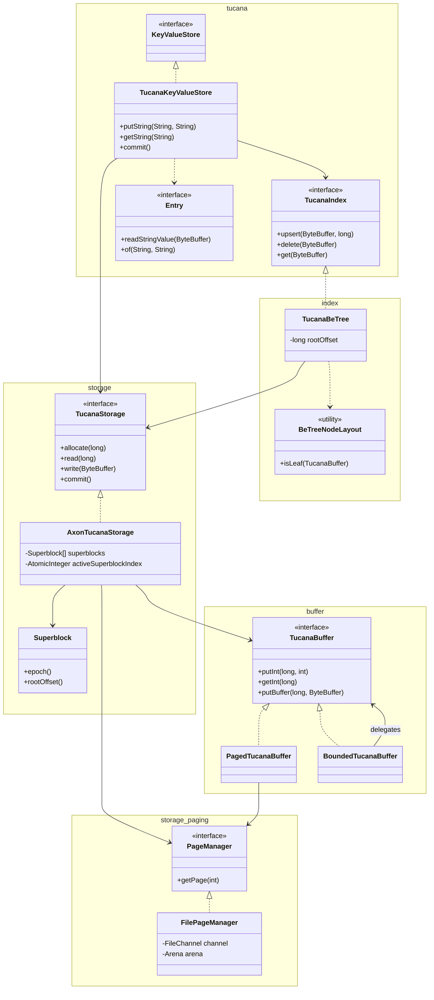
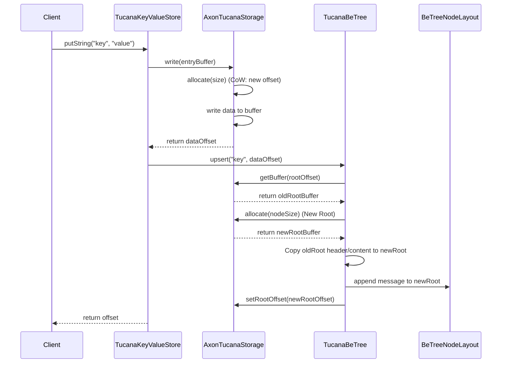
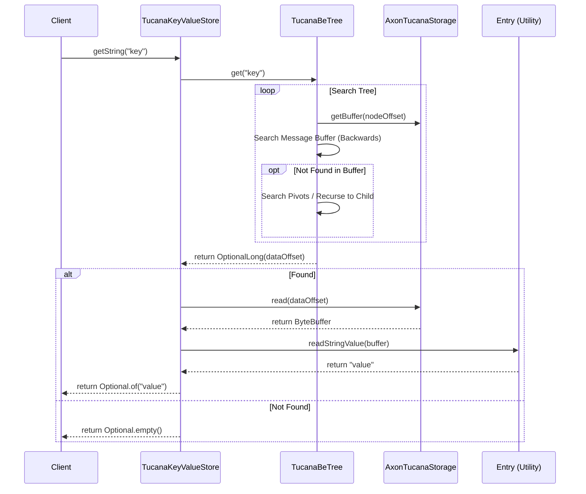

# Tucana Key-Value Store Architecture

The `tucana` package implements a high-performance, write-optimized Key-Value Store based on the Tucana architecture (
USENIX ATC '16). It leverages a **Bε-tree** for indexing and a **persistent, Copy-on-Write (CoW)** storage layer for
atomic consistency.

## Core Design Principles

- **Zero-Object Indexing**: The index logic operates directly on raw memory buffers. No intermediate Java objects are
  created for nodes or entries during hot-path operations (get, upsert, delete), significantly reducing GC pressure.
- **Zero-Copy Data Flow**: Uses Java's `ByteBuffer` and `MemorySegment` (FFM API) to manage data. Slicing and direct
  memory access ensure data is moved only when absolutely necessary.
- **Write Optimization (Bε-tree)**: Unlike traditional B-trees that update leaves immediately, Bε-trees buffer updates (
  UPSERT/DELETE messages) in internal nodes. These messages are lazily flushed down to the leaves, converting random
  writes into efficient sequential-like I/O.
- **Crash Consistency**: Atomic commits are guaranteed via a dual-superblock mechanism and strict Copy-on-Write (CoW) of
  all data and index nodes.

## Package Structure

The implementation is organized into the following subpackages:

- **`es.nachobrito.vulcanodb.core.store.axon.kvstore.tucana`**: Core API and data models (`TucanaKeyValueStore`,
  `TucanaIndex`, `Entry`).
- **`...tucana.storage`**: Storage management, file I/O, and transaction support (`TucanaStorage`, `AxonTucanaStorage`,
  `Superblock`).
- **`...tucana.storage.paging`**: Low-level page management (`PageManager`, `FilePageManager`).
- **`...tucana.buffer`**: Memory buffer abstractions over FFM (`TucanaBuffer`, `PagedTucanaBuffer`,
  `BoundedTucanaBuffer`).
- **`...tucana.index`**: B-Tree implementation details (`TucanaBeTree`, `BeTreeNodeLayout`).

## Class Diagram



## Physical Data Layout

### Database File Structure

The database is contained in a single file, organized into 1MB pages managed by the FFM API:

| Region                     | Description                                                     |
|:---------------------------|:----------------------------------------------------------------|
| **Page 0: Header**         | Contains two `Superblock` instances (SB0, SB1).                 |
| **Page 1...N: Data/Index** | Mixed region containing Bε-tree nodes and physical data blocks. |

### Node Binary Layout (Bε-tree)

Each node is a fixed-size block within a `TucanaBuffer` (managed by `BeTreeNodeLayout`):

```text
[0-3]   Magic Number (Internal: 0xBE77EE11, Leaf: 0xBE77EE22)
[4-7]   Checksum (CRC32)
[8-11]  Item Count (Pivots or Entries)
[12-15] Message Buffer Offset (End of current messages)
[16-23] Parent Offset (Used for CoW path updates)
[24...] Payload:
        Internal: [Pivots/Child Offsets] + [Message Buffer Area]
        Leaf:     [Sorted Key-Value Entries] + [Message Buffer Area]
```

## Sequence Diagrams

### 1. Upsert Operation (Write Path)

When a key-value pair is inserted, data is first persisted to storage, and then the index is updated. The index update
triggers a Copy-on-Write (CoW) operation for the path from the modified node to the root.



### 2. Get Operation (Read Path)

Reading involves querying the index to find the data offset, then reading the data from storage.



## Memory Management (FFM API)

Tucana leverages the Java 22+ **Foreign Function & Memory (FFM) API**:

- **`FilePageManager`**: Maps the physical file into `MemorySegment` pages on-demand.
- **`PagedTucanaBuffer`**: Provides a unified, offset-based view over multiple non-contiguous memory segments.
- **`Superblock`**: Operates on a direct `MemorySegment` slice of the file's header.

This allows VulcanoDB to manage multi-terabyte datasets with the performance of raw pointers while staying within the
safety and structure of the JVM.

# References

- [A.Papagiannis, G. Saloustro, P. González-Férez and A. Bilas, “Tucana: Design and Implementation of a Fast
  and Efficient Scale-up Key-value Store”, in Proc. USENIX ATC, 2016](https://www.usenix.org/system/files/conference/atc16/atc16_paper-papagiannis.pdf)
- [Michael A. Bender, Martin Farach-Colton, William Jannen, Rob Johnson, Bradley C. Kuszmaul, Donald E. Porter, Jun Yuan, and Yang Zhan, "An Introduction to Bε-trees and Write-Optimization"](https://www.usenix.org/publications/login/oct15/bender)