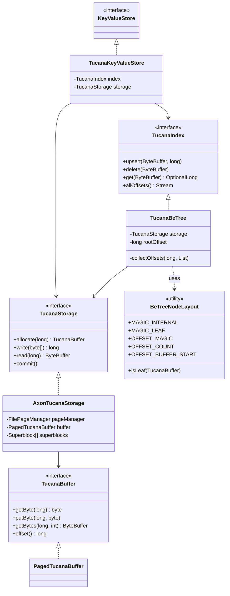

# Tucana Key-Value Store Architecture

The `tucana` package implements a high-performance, write-optimized Key-Value Store based on the Tucana architecture (USENIX ATC '16). It leverages a **Bε-tree** for indexing and a **persistent, Copy-on-Write (CoW)** storage layer for atomic consistency.

## Core Design Principles

- **Zero-Object Indexing**: The index logic operates directly on raw memory buffers. No intermediate Java objects are created for nodes or entries during hot-path operations (get, upsert, delete), significantly reducing GC pressure.
- **Zero-Copy Data Flow**: Uses Java's `ByteBuffer` and `MemorySegment` (FFM API) to manage data. Slicing and direct memory access ensure data is moved only when absolutely necessary.
- **Write Optimization (Bε-tree)**: Unlike traditional B-trees that update leaves immediately, Bε-trees buffer updates (UPSERT/DELETE messages) in internal nodes. These messages are lazily flushed down to the leaves, converting random writes into efficient sequential-like I/O.
- **Crash Consistency**: Atomic commits are guaranteed via a dual-superblock mechanism and strict Copy-on-Write (CoW) of all data and index nodes.

## Class Diagram



## Physical Data Layout

### Database File Structure
The database is contained in a single file, organized into 1MB pages managed by the FFM API:

| Region | Description |
| :--- | :--- |
| **Page 0: Header** | Contains two `Superblock` instances (SB0, SB1). |
| **Page 1...N: Data/Index** | Mixed region containing Bε-tree nodes and physical data blocks. |

### Node Binary Layout (Bε-tree)
Each node is a fixed-size block within a `TucanaBuffer`:

```text
[0-3]   Magic Number (Internal: 0xBE77EE11, Leaf: 0xBE77EE22)
[4-7]   Checksum (CRC32)
[8-11]  Item Count (Pivots or Entries)
[12-15] Message Buffer Offset (End of current messages)
[16-23] Parent Offset (Used for CoW path updates)
[24...] Payload:
        Internal: [Pivots/Child Offsets] + [Message Buffer Area]
        Leaf:     [Sorted Key-Value Entries] + [Message Buffer Area]
```

## Data Lifecycle & Consistency

### The Copy-on-Write (CoW) Path
Every mutation in Tucana follows a strict CoW protocol:
1.  **Data Write**: New values are written to a fresh offset in the storage.
2.  **Node Update**: Instead of modifying an existing index node, a new `TucanaBuffer` is allocated.
3.  **Path Re-linking**: The parent node is also re-allocated to point to the new child offset. This recurses up to the root.
4.  **Root Swap**: The new root offset is stored in the active (but not yet committed) state.

### Atomic Commit Protocol
Tucana uses two Superblocks to guarantee atomicity:
1.  **Preparation**: All new data and nodes are persisted to disk.
2.  **Superblock Sync**: The *inactive* `Superblock` is updated with the new `rootOffset`, `allocatorOffset`, and an incremented `epoch`.
3.  **Atomic Swap**: The index of the active superblock is flipped. On restart, the system always picks the valid superblock with the highest epoch.

## Search and Buffering Logic

When querying a key:
1.  **Message Buffer Search**: The system first scans the current node's message buffer *backwards*. If an `UPSERT` or `DELETE` message for the key is found, it is returned immediately (Bε-trees always prioritize buffered updates).
2.  **Pivot/Child Navigation**: If not found in the buffer and the node is internal, the key is compared against pivots to select the correct child, and the search recurses.
3.  **Leaf Search**: In leaf nodes, the sorted entries are searched after checking the buffer.

## Memory Management (FFM API)

Tucana leverages the Java 22+ **Foreign Function & Memory (FFM) API**:
- **`FilePageManager`**: Maps the physical file into `MemorySegment` pages on-demand.
- **`PagedTucanaBuffer`**: Provides a unified, offset-based view over multiple non-contiguous memory segments.
- **`Superblock`**: Operates on a direct `MemorySegment` slice of the file's header.

This allows VulcanoDB to manage multi-terabyte datasets with the performance of raw pointers while staying within the safety and structure of the JVM.
